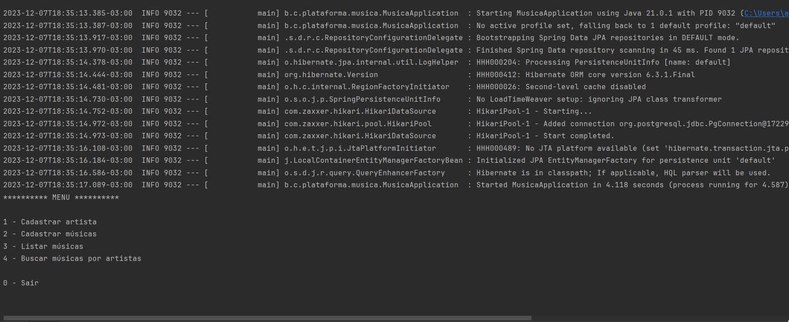

## Visão Geral

O projeto foi desenvolvido com o objetivo de gerenciar o cadastro de músicas e artistas utilizando Java com Spring Boot, JPA e PostgreSQL como banco de dados.

## Funcionalidades Principais

- Cadastro de músicas e artistas
- Relacionamento entre músicas e artistas
- Armazenamento e consulta no banco de dados PostgreSQL
- Utilização de Spring Boot para facilitar o desenvolvimento
- Utilização do Maven para armazenamento das dependencias

## Projeto em funcionamento

